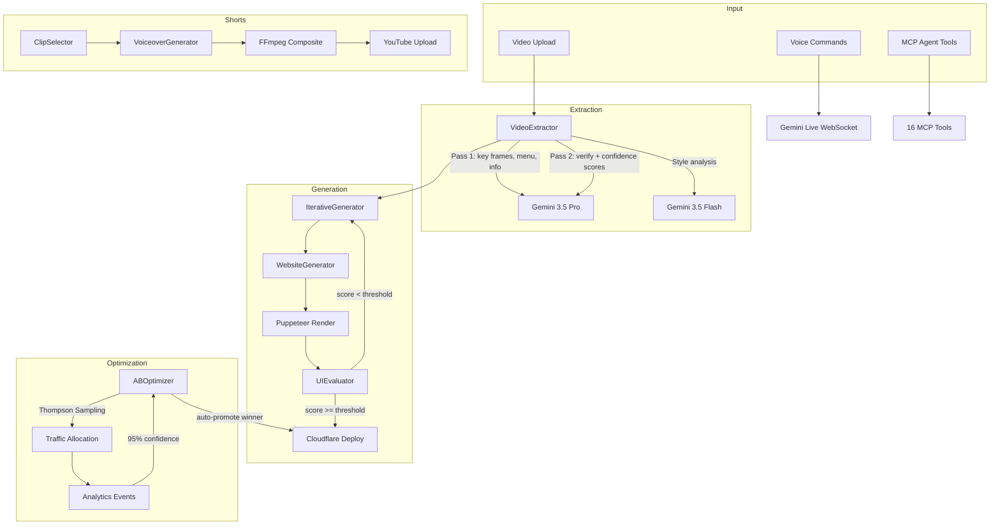
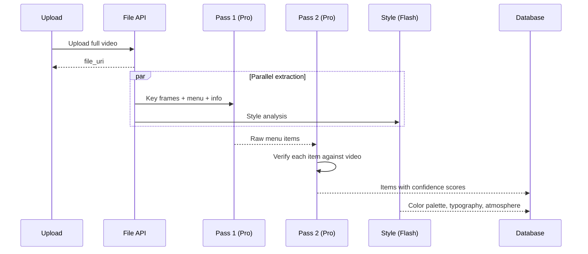
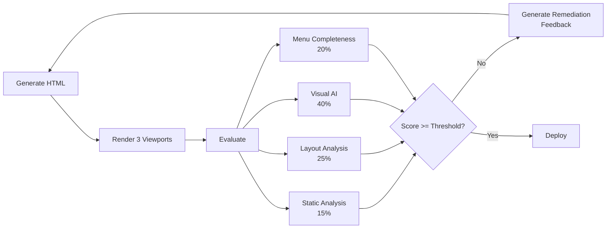
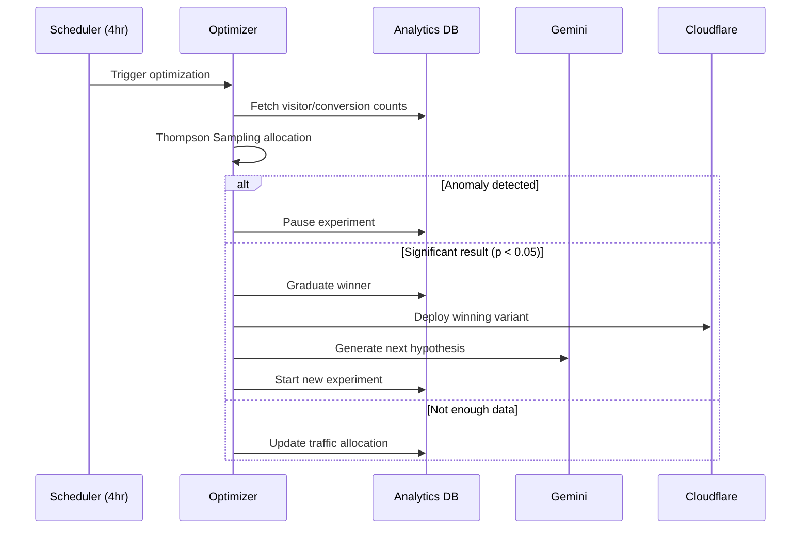
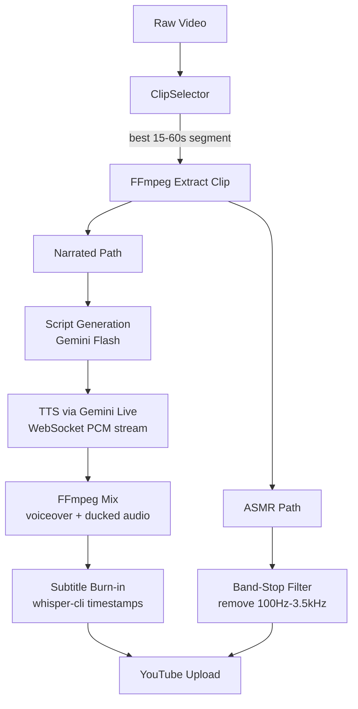
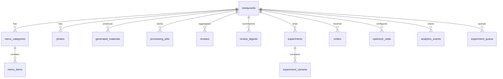

# Pique

Pique turns a single walkthrough video of a restaurant into a fully operational web presence — website, YouTube Shorts, review digests, and autonomous A/B testing — without the owner touching anything after upload. The system is built around the idea that most restaurant owners have zero time for marketing and zero interest in learning design tools, but they *can* film a 2-minute video on their phone.

The core technical bet is that native multimodal video understanding (Gemini's File API) combined with iterative generation loops produces dramatically better output than one-shot prompting or frame-based extraction. Every pipeline in the system follows the same pattern: generate, evaluate with deterministic checks, feed failures back in, repeat.

## Architecture



## Video Extraction

The extraction pipeline was the hardest part to get right. The first approach sampled frames at fixed intervals and fed them individually to Gemini, which consistently missed menu items — a 30-item menu would come back with 5-8 items because no single frame contained the full menu board, and the model had no temporal context to piece together partial views.

The solution was native video upload via Gemini's File API. The full video gets uploaded once, then three analysis prompts run in parallel against it: one for key frame selection (sharp, well-lit, varied shots), one for exhaustive menu extraction, and one for restaurant metadata (name, cuisine, hours, vibe). A separate Flash model call extracts style signals (color palette, typography feel, atmosphere) used downstream by the website generator.

Menu extraction uses a two-pass verification step. The first pass pulls every visible item with prices. The second pass re-examines the video specifically looking for items that might have been missed and assigns confidence scores (0.0-1.0) to each item. This catches hallucinated items early — if the model invents "Dragon Roll" at a Chinese restaurant, the verification pass flags it with low confidence and it gets dropped before it reaches the website.



## Iterative Website Generation

One-shot website generation with LLMs produces HTML that is technically valid but visually broken — overflowing text on mobile, missing menu items, hallucinated prices, tiny touch targets. The iterative generator fixes this by closing the loop: generate HTML, render it in a headless browser, evaluate the render, and feed specific failures back into the prompt for the next iteration.

Each iteration renders the site at three viewports (mobile 375px, tablet 768px, desktop 1280px) and runs four layers of evaluation. Static analysis (15% of score) checks for viewport meta tags, alt text, media queries, and rendering artifacts like literal `undefined` in the output. Layout analysis (25%) uses Puppeteer's `page.evaluate()` to measure actual bounding rectangles — it catches horizontal overflow with 5px tolerance, flags touch targets under 44x44px, and computes text contrast using the ITU-R BT.709 relative luminance formula. Visual AI evaluation (40%) sends the three viewport screenshots to Gemini Flash and scores typography, spacing, color usage, and overall aesthetic coherence. Menu completeness (20%) is fully deterministic — it cross-references every menu item in the database against the rendered HTML using case-insensitive substring matching, and separately checks for hallucinated items that don't exist in the source data.

When a site fails, the evaluator doesn't just return a number. It generates a structured remediation list — "6 elements overflow on mobile: .menu-grid at 412px wide on a 375px viewport" or "Missing 3 menu items: Kung Pao Chicken, Ma Po Tofu, Scallion Pancake" — that gets injected directly into the generation prompt for the next pass. The generator also tracks the best menu completeness score across iterations and rolls back if a later iteration regresses (fixes layout but accidentally drops menu items).



## A/B Testing with Thompson Sampling

Once a website is live, the optimizer runs autonomously on a 4-hour cycle. It uses Thompson Sampling for traffic allocation, which is a Bayesian approach that naturally balances exploration and exploitation. Each variant maintains a Beta distribution parameterized by its observed successes and failures. On each request, the system samples from each variant's posterior and routes traffic to whichever sample is highest. This means promising variants get more traffic quickly, but underperforming ones still get enough to confirm they're actually worse.

The optimizer generates experiment hypotheses using Gemini, informed by the restaurant's data and the cumulative history of past experiments (what worked, what didn't). Each hypothesis targets a specific change type — CTA copy, hero image, layout, color scheme, menu presentation — and gets queued with a priority score. The system maintains a pre-filled queue of 5 hypotheses to avoid cold-start delays between experiments.

Anomaly detection runs on every optimization cycle. If either variant's conversion rate deviates more than 3 standard deviations from the 30-day baseline, the experiment pauses automatically. This prevents a broken variant from tanking revenue while the test runs to completion. Experiments auto-graduate at 95% statistical confidence, the winning variant's HTML gets deployed to Cloudflare, and the next hypothesis in the queue starts immediately.



## Shorts Pipeline

The shorts pipeline takes a raw cooking video and produces two YouTube-ready variants: a narrated version with AI voiceover and burned-in subtitles, and an ASMR version that strips speech frequencies and keeps only cooking sounds (sizzle, chop, crunch).

Clip selection uses native video understanding rather than heuristics. The full video uploads to Gemini, which identifies the best 15-60 second segment based on visual hook strength (the first 3 seconds need to grab attention), narrative arc (setup-action-payoff, like raw ingredients to sizzling to plated), and pacing. The model returns timestamps with reasoning and a confidence score.

For the narrated variant, voiceover generation is a two-step process. First, Gemini watches the selected clip and writes a script calibrated to the clip duration (~2.5 words/second). Then the script is synthesized to audio via Gemini Live's WebSocket API, which streams PCM chunks that get assembled into a WAV file. FFmpeg handles the final composite: clip extraction, audio mixing (voiceover at full volume, original audio ducked), and subtitle burn-in using word-level timestamps from whisper-cli.

The ASMR variant runs the original audio through a band-stop filter that removes 100Hz-3.5kHz (the speech frequency range) while preserving cooking sounds above and below that band.



## Voice Interface

The voice assistant uses Gemini Live's bidirectional WebSocket for real-time conversation. The client captures microphone audio as PCM (44.1kHz, 16-bit mono), streams it to the server, which relays it to Gemini's `BidiGenerateContent` endpoint. Gemini responds with interleaved audio chunks and tool call requests.

Tool calls are where it gets interesting. The voice model has access to the same 16 MCP tools as the rest of the system — it can look up menu items, modify the website, check A/B test results, trigger shorts generation, or pull review digests, all mid-conversation. When Gemini issues a tool call, the server executes it against the local database/services and streams the result back into the conversation context, so the model can speak the answer naturally.

The system prompt gets injected with the restaurant's full context (menu, recent reviews, active experiments, latest digest) so the assistant can answer questions without tool calls when possible. Review digests are pushed to the voice context on generation, giving the assistant proactive knowledge about recent customer sentiment.

## Data Model



The database is sql.js (SQLite compiled to WebAssembly) with file persistence. This was a deliberate choice over a client-server database — the entire system runs as a single Node process with no external dependencies beyond API keys. The tradeoff is no concurrent write access, which is fine for the single-tenant restaurant use case.

## MCP Integration

The system exposes 16 tools via the Model Context Protocol, which means any MCP-compatible agent (Claude, custom agents, the built-in voice assistant) can drive the full pipeline programmatically. Tools include `create_restaurant` (video extraction), `create_website` (iterative generation), `modify_website` (natural language edits), `create_youtube_short` (full shorts pipeline), `generate_review_digest`, `get_optimizer_status`, and others.

This is the unifying layer — the voice UI, the web interface, and direct MCP calls all hit the same tool implementations. Adding a new capability means adding one tool definition, and it's immediately available everywhere.

## Stack

| Layer | Technology |
|-------|-----------|
| Runtime | Node.js (ESM) |
| Server | Express |
| Database | sql.js (SQLite → Wasm) |
| AI | Gemini 3.5 Pro/Flash, Gemini Live, Imagen 3 |
| Video | FFmpeg, Sharp |
| Browser automation | Puppeteer |
| Speech | whisper-cli (local), Gemini Live TTS |
| Hosting | Cloudflare Pages (generated sites) |
| Payments | Stripe |
| Tests | Playwright |

## Setup

```bash
cp .env.example .env
# Add: GEMINI_API_KEY, CLOUDFLARE_ACCOUNT_ID, CLOUDFLARE_API_TOKEN,
#       STRIPE_SECRET_KEY, YOUTUBE_CLIENT_ID, YOUTUBE_CLIENT_SECRET

npm install
npm start        # http://localhost:3000
```
